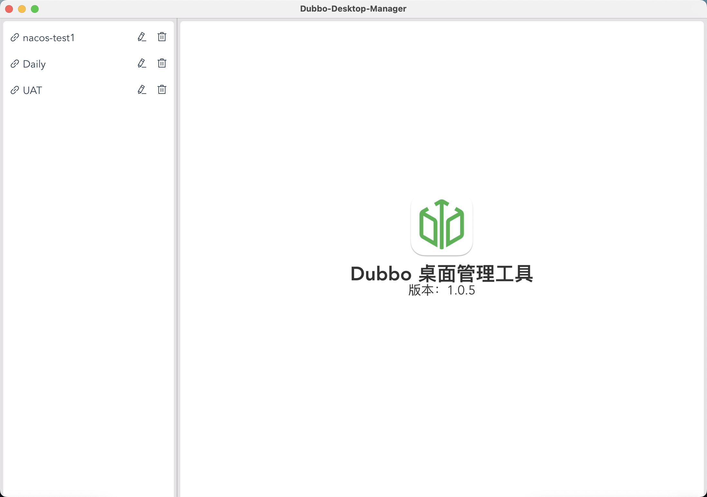
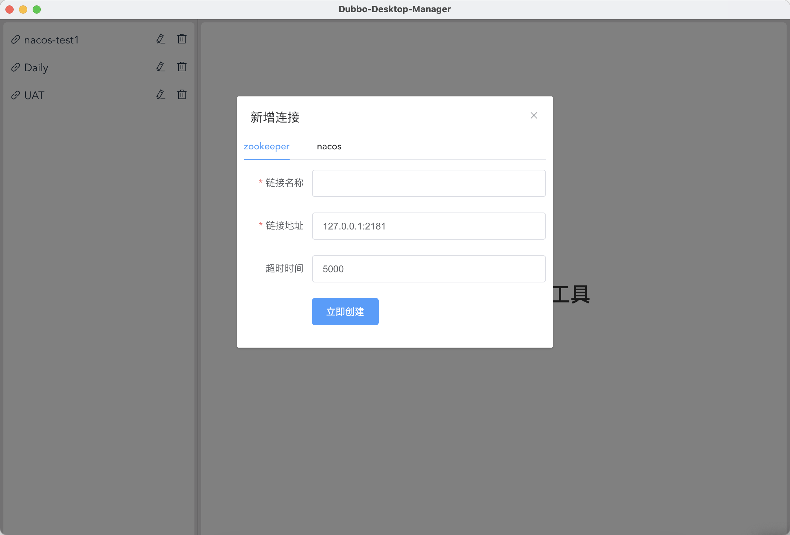
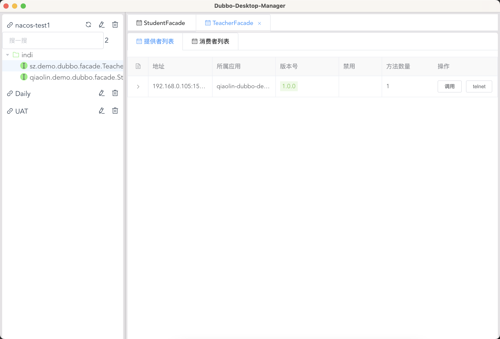
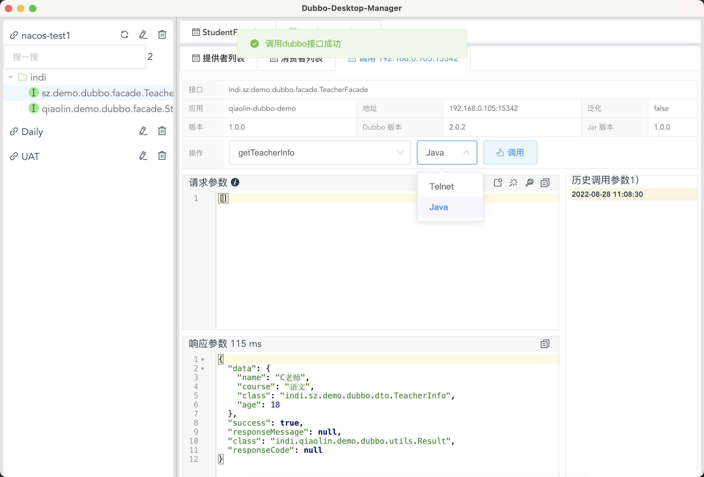
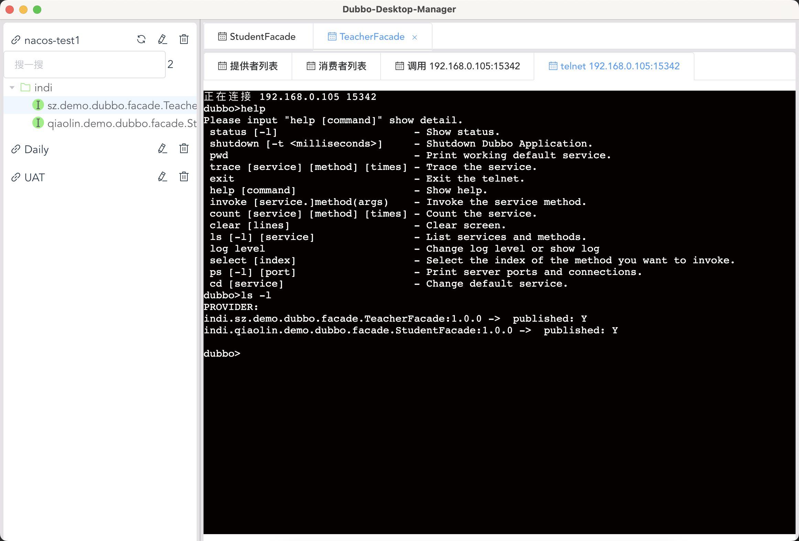
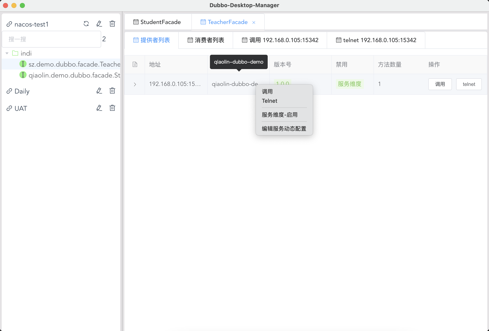
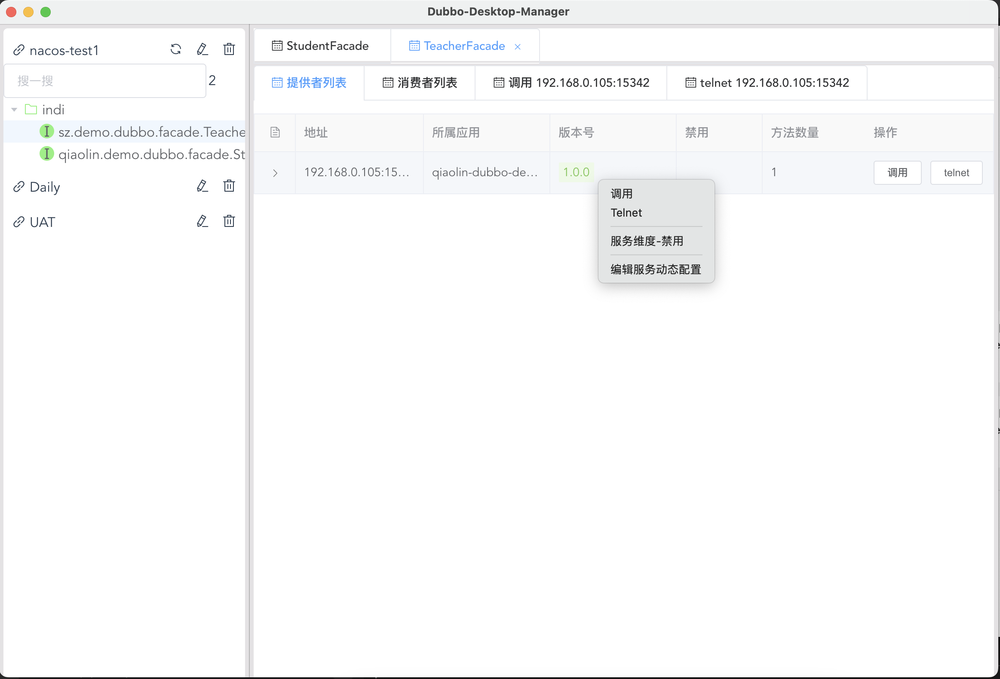
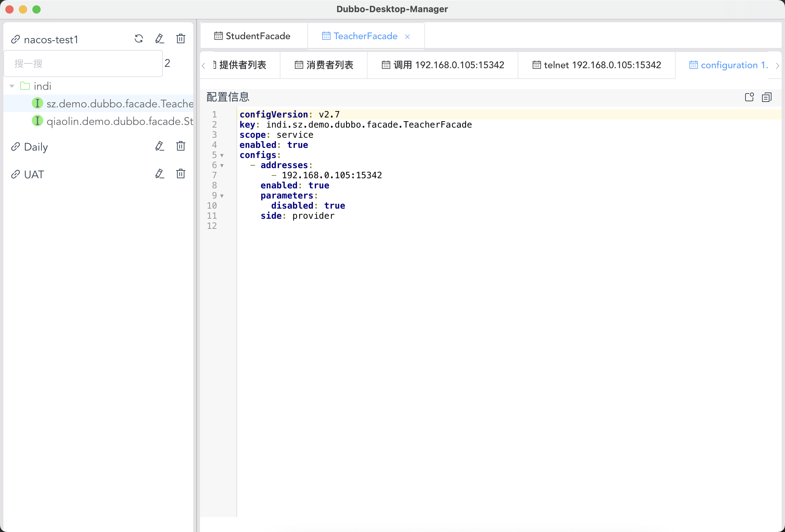

<h1 align="center">
  
   Dubbo-Desktop-Manager 
</h1>
 <h4 align="center">一个Dubbo的桌面管理软件</h4>

  <a href="https://github.com/qiaolin-li/dubbo-desktop-manager/releases">Windows下载</a>
  &nbsp;&nbsp;|&nbsp;&nbsp;
  <a href="https://github.com/qiaolin-li/dubbo-desktop-manager/releases">Mac Intel 芯片下载</a>
    &nbsp;&nbsp;|&nbsp;&nbsp;
  <a href="https://github.com/qiaolin-li/dubbo-desktop-manager/releases">Mac M1 芯片下载</a>

## 一、功能简介
- 支持多注册中心（ zookeeper、nacos）
- 支持服务名（接口名）搜索
- 可查看服务下所有的提供者和消费者
- 可调用服务提供者的方法（Telnet + Java方式）
- 生成提供者方法的默认参数（参考dubbo-admin）
- 支持方法历史参数填充
- 支持生成invoke 命令
- 支持telnet直接连接到提供者
- 服务启用、禁用、配置编辑

## 二、功能截图

### 2.1、工具主界面

### 2.2、支持多注册中心

### 2.3、服务搜索&查看服务下提供者和消费者

### 2.4、生成提供者方法的默认参数&调用提供者方法

### 2.5、直接telnet提供者

###  2.6、服务启用/禁用

### 2.7、编辑服务配置

## #、其他

1. [如何自己构建DDM](./docs/build.md)
2. [参考资料](./docs/reference.md)

