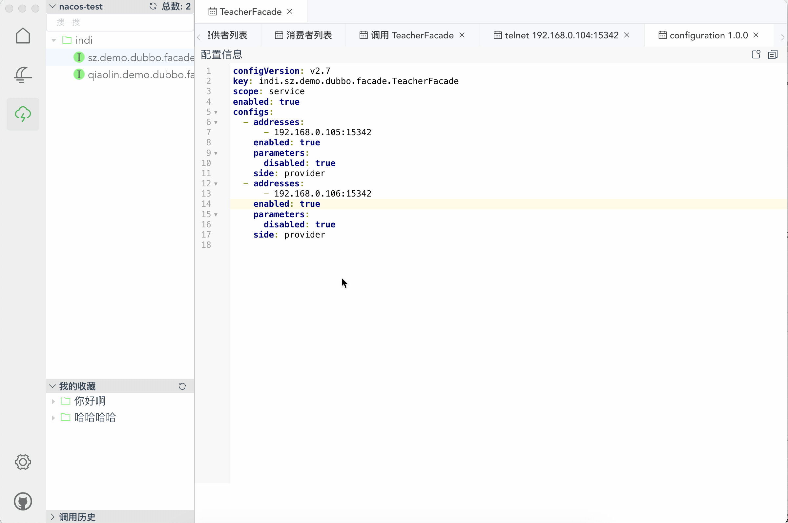

<h1 align="center">
  
  <br>Dubbo-Desktop-Manager<br>
</h1>
 <h4 align="center">一个API桌面管理软件</h4>

<p align="center">
  <a href="../../releases">Windows下载</a>
  &nbsp;&nbsp;|&nbsp;&nbsp;
  <a href="../../releases">Mac Intel 芯片下载</a>
    &nbsp;&nbsp;|&nbsp;&nbsp;
  <a href="../../releases">Mac M1 芯片下载</a>
</p>

## 一、功能简介
- 支持多注册中心（ zookeeper、nacos、dubbo-admin或dubbo-admin相同协议的服务）
- 支持多数据源同时管理
- 支持服务搜索、服务收藏、调用历史、服务提供者和消费者展示、 服务启用、禁用、配置编辑
- 支持服务调用（目前已支持dubbo、http等协议，如有需要可提）、快捷生成`invoke`命令、支持方法填充（历史参数、默认参数）
- 支持telnet直接连接到提供者


## 二、功能截图





## 三、常见问题
### 3.1、Mac出现：已损坏，无法打开
需要执行如下命令
```java
sudo xattr -d com.apple.quarantine /Applications/Dubbo-Desktop-Manager.app
```

### 3.2、如何配置JDK17+
使用jdk17+需要配置如下jvm参数
```java
 --add-opens java.management/java.lang.management=ALL-UNNAMED --add-opens jdk.management/com.sun.management.internal=ALL-UNNAMED --add-opens java.management/sun.management=ALL-UNNAMED --add-opens java.base/java.time=ALL-UNNAMED --add-opens java.base/java.util.concurrent=ALL-UNNAMED --add-opens java.base/java.util.concurrent.locks=ALL-UNNAMED --add-opens java.base/java.security=ALL-UNNAMED --add-opens java.base/jdk.internal.loader=ALL-UNNAMED --add-opens java.management/com.sun.jmx.mbeanserver=ALL-UNNAMED --add-opens java.base/java.net=ALL-UNNAMED --add-opens java.base/sun.nio.ch=ALL-UNNAMED --add-exports java.base/sun.security.action=ALL-UNNAMED --add-opens java.base/java.lang=ALL-UNNAMED --add-opens java.base/java.math=ALL-UNNAMED --add-opens java.base/java.util=ALL-UNNAMED --add-opens java.base/java.text=ALL-UNNAMED --add-opens java.base/sun.util.calendar=ALL-UNNAMED
```


### 3.3、如何连接到dubbo-admin?
1. 打开dubbo-admin并且打开F12
2. 从控制台中虽然找到一个发往后台的请求地址，拿到它的前缀

3. 新建连接，选择dubbo-admin


### 3.4、为什么出现找不到元数据？
1. dubbo2.7以后才有元数据，如果你是2.7之前的版本，那是没办法进行参数填充的，需要自行补齐参数类型
2. 如果是2.7之后的版本，那么检查一下是否配置了上报元数据
3. 如果上面都没问题，可能是元数据未上报....


## 四、如何自己构建DDM
[>>> 点我获得构建DDM的教程](./docs/build.md)

## 五、参考资料
因为下面这些框架、博客才有这个工具的诞生

首先感谢 MARKSZのBlog 大佬Electron系列博客，大而全，给了我很多参考的地方，也从里面CV了部分代码
博客地址：https://molunerfinn.com/electron-vue-1/#Electron%E7%AE%80%E8%A6%81%E4%BB%8B%E7%BB%8D

终端参考自：https://www.codeprj.com/blog/c9bde01.html

分隔栏参考自：https://github.com/PanJiaChen/vue-split-pane
