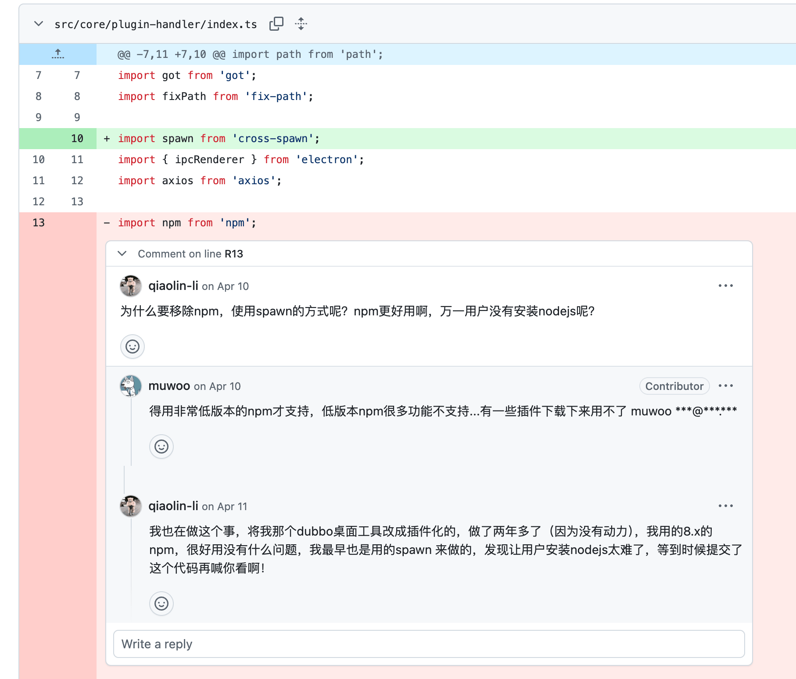

# Electron 内置 npm 方案：打造无需 Node.js 环境的插件安装器

## 为什么要内置 npm

最初 [Dubbo-Desktop-Manager](https://github.com/qiaolin-li/dubbo-desktop-manager) （简称 ddm）是`All in One`软件包。哪怕只改一个小功能，用户也得重新下载完整安装包。

用户都是很“懒”的：旧版本能用，就不想重新下载安装。加上没“给果子交钱”，没有经过 Apple 签名和公证，macOS 安装时困难重重。

所以我把软件升级为插件模式：app 只提供稳定的宿主能力，Dubbo 等功能由插件实现。插件可以独立安装和升级，体积小，也不用每次更新功能都重新发布本体。

插件包使用 npm 分发很合适。它已经解决了发布、版本、依赖和镜像等问题，但新的问题也随之出现：**怎样执行 `npm install` 安装插件呢？**

## 从 PicGo 的 `spawn` 方案开始

做插件系统前，我先阅读了 PicGo 作者 MARKSZ 的 [Electron 系列博客](https://molunerfinn.com/electron-vue-1/#Electron%E7%AE%80%E8%A6%81%E4%BB%8B%E7%BB%8D)，之后又研究了 [PicGo](https://github.com/Molunerfinn/PicGo) 和 [PicGo Core](https://github.com/PicGo/PicGo-Core) 的源码。它们对我的插件系统帮助很大，在此特别感谢 PicGo 作者。

PicGo Core 使用 `cross-spawn` 启动系统 npm：

```js
const npm = spawn('npm', args, {
    cwd: pluginDirectory
})
```

我最初也尝试了这种方式。它简单、完整，但依赖用户安装 Node.js/npm。

`ddm`的未来定位是任何人可用易用的插件工具平台，未必他们会正确的安装 `Node.js`，所以这个方案不符合我们的要求。

## 尝试 npm 6 的编程接口

我后续又了解到，npm 6 可以作为项目依赖直接调用：

```js
import npm from 'npm'

npm.load(config, err => {
    npm.commands[command](modules, callback)
})
```

这种方案不依赖系统 npm，但只能配合很低版本的 npm 使用。低版本 npm 功能不足，部分插件安装后无法正常使用。

后来我看到 Rubick 在 [de0e9ed8](https://github.com/rubickCenter/rubick/commit/de0e9ed8f20bfdabfb492922d50e8cd004e8af7a) 中删除了同样的 npm 依赖调用，改为 `cross-spawn`，让用户自行安装 Node.js。我和 Rubick 作者交流了一下，确认原因同样是低版本 npm 的限制：



## 阅读 npm 8 源码

既然`npm6`可用，那么`npm8`也应该是可以的，我开始查看 `npm@8.19.4` 的源码。

npm 8 直接执行 `require('npm')` 会进入根 `index.js`，并抛出：

```text
The programmatic API was removed in npm v8.0.0
```

但继续查看源码可以发现，npm CLI 仍然是运行在 Node.js 上的 JavaScript 程序，核心 `Npm` 类位于 `lib/npm.js`。

Electron 主进程就是 Node.js。因此我的最终方案是：把完整的 npm 8 打进应用，绕过根 `index.js`，直接加载 `lib/npm.js`，然后调用 `load()` 和 `exec()`。

项目固定 npm 版本并通过 Electron Builder 复制完整目录：

```json
{
    "dependencies": {
        "npm": "8.19.4"
    },
    "build": {
        "extraResources": [
            "./node_modules/npm"
        ]
    }
}
```

## NpmUtils 完整实现

`NpmUtils` 负责加载内置 npm、指定安装目录、选择镜像并转发安装日志：

```js
// 开发和生产环境使用不同的 npm 路径：
const APPLICATION_NPM_PATH_PREFIX = IS_DEVELOPMENT
	? path.join(process.cwd(), 'node_modules/npm/')
    : path.join(process.resourcesPath, 'node_modules/npm/')

class NpmUtils {
    
    async execCommand (command, args, where){
        if (!command) {
            throw new Error('command is a must');
        }

        process.argv[0] = ''
        process.argv[1] = 'dist_electron'
        process.argv[2] = command
        for (let i = 0; i < args.length; i++) {
            process.argv.push(args[i]);
        }

        const Npm = require(`${APPLICATION_NPM_PATH_PREFIX}/lib/npm.js`)

        class MyNpm extends Npm {

            constructor (localPrefix) {
                super()
                this.localPrefix = localPrefix;
            }

			/** 安装依赖时会修改title，可能会影响应用的title，所以重写忽略 */
            set title (t) { }
        }

        const npm = new MyNpm(where)
        const stdoutWrite = process.stdout.write;
        const stderrWrite = process.stderr.write;

        try {
            process.stdout.write = (...msg) => {
                npm.output(...msg)
            }

            process.stderr.write = (...msg) => {
                npm.outputError(...msg)
            }
        
            await npm.load()

			// 可以设置更快的仓库
            npm.config.set('registry', 'https://registry.npmmirror.com/')
            const cmd = npm.argv.shift()
            await npm.exec(cmd, npm.argv)
        } finally {
            process.stdout.write = stdoutWrite;
            process.stderr.write = stderrWrite;
        }

        return npm.message;
    }    
}

export default new NpmUtils();
```

## 使用案例

安装插件：

```js
await npmUtils.execCommand('install', ['ddm-plugin-dubbo-support@1.0.0', '--loglevel', 'info'], pluginDirectory)
```

卸载插件：

```js
await npmUtils.execCommand('uninstall', ['ddm-plugin-dubbo-support', '--loglevel', 'info'], pluginDirectory)
```
